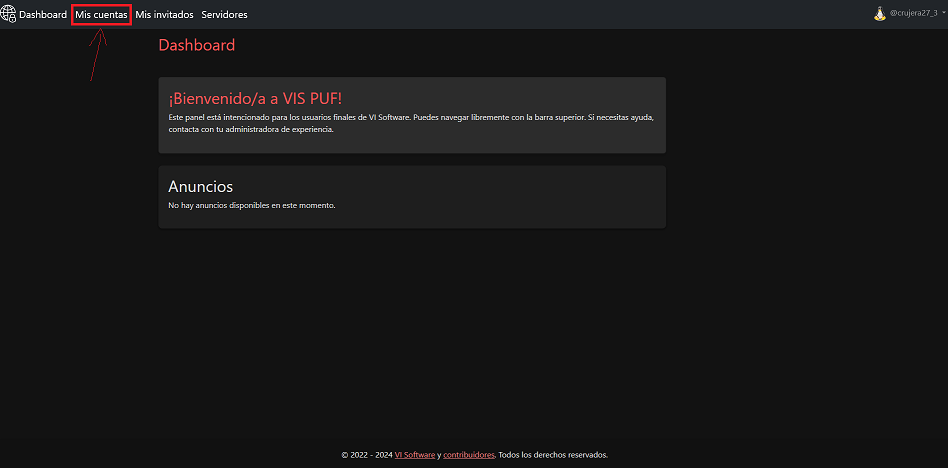

# 🔑 Ver la información de mi cuenta

1. Inicia sesión en [https://puf-vis.galnod.com/login](https://puf-vis.galnod.com/login) con tu cuenta de Discord en la que estás en el VIS Discord.
2. Una vez estés en el dashboard, navega con la barra superior a "Mis cuentas".

<figure><figcaption></figcaption></figure>

3. Una vez en esta página, podrás ver todas tus cuentas, incluyendo, sus usuarios, sus tókenes (contraseñas), rango, el estado y un acceso rápido para gestionar su cuenta (cambiar skin, cambio de contraseña...)

<figure><figcaption>
Para ver su token, ponga el ratón encima de la palabra "OCULTO"
</figcaption></figure>
